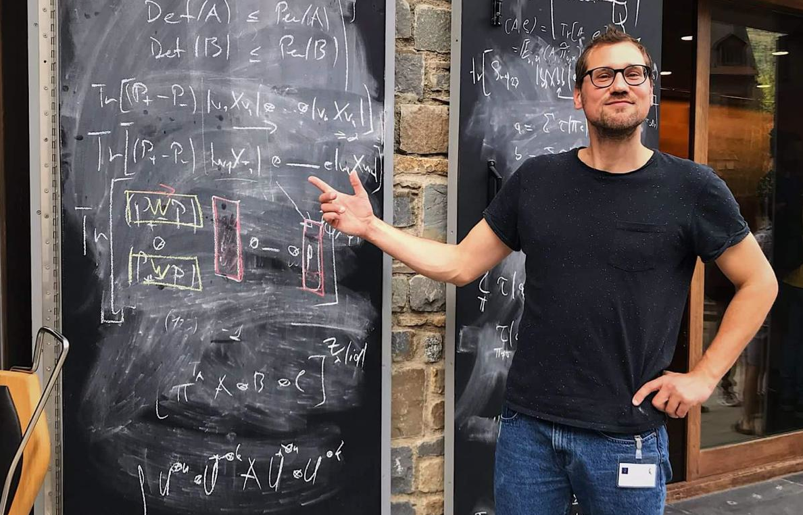

Since 2024, I am a Junior Professor (CPJ) for Quantum Algorithms at the [Bordeaux Computer Science Laboratory](https://labri.fr). I also head the [Quantum information and Computation Group](https://quantique.labri.fr/). From 2001 to 2003 I led the [Quantum Error Correction Group](https://nisq.pl/quantum-error-correction-group)
at the Jagiellonian University in Kraków.

I was a postdoctoral fellow in the groups of [David Gross](https://qi.uni-koeln.de/) at the University of Cologne and [Antonio Acín](https://www.icfo.eu/research-group/7/quantum-information/home/437/) at ICFO Barcelona. I was Ph.D. student at the University of Siegen, advised by [Otfried Gühne](https://www.physik.uni-siegen.de/tqo/). My [thesis](https://dspace.ub.uni-siegen.de/handle/ubsi/1272) won the [2019 Dissertation Prize](https://www.dpg-physik.de/auszeichnungen/preise-der-dpg-vereinigungen/preistraeger-dissertationspreis-samop) by the section AMOP of the German Physical Society.

## Research Interests
I work onthe characterization of quantum correlations like entanglement and nonlocality, on quantum error correction (theoretical characterizations and proposals for experimental implementations), and mathematical optimization in quantum information and computation. I also do a bit of mathematics in the field of on non-commutative algebra.

I like problems like quantum Max Cut, the [quantum marginal problem](https://arxiv.org/abs/2211.06349), making connections to [graph theory](https://arxiv.org/abs/2310.00612), the [detection](https://arxiv.org/abs/2108.08720) of [entanglement](https://arxiv.org/abs/1708.06298), quantum zero-error communication, and mutually unbiased bases :)

I also like noncommutative algebra, like [tensor polynomial identities](https://arxiv.org/abs/2011.04362) and [matrix inequalities](https://arxiv.org/abs/2002.12887).

## Team

- Moises Bermejo Moran (PhD student)
- Gerard Munné (PhD student)
- Albert Rico (PhD student)

Previous members:
- Stefan Kessler (MSc student)
- Vinayak Jagadish (Postdoc)

## Projects/Grants
- Agence National de la Recherche (ANR) Chaire professeur junior "Algorithmique quantique" (2024 --- 2029)
- Naquidis grant (2024 --- 2029)
- [Quantum error correction group](https://nisq.pl/quantum-error-correction-group) of the [“Near-term quantum computers, optimal implementations and applications”](nisq.pl) consortium, supported by the TEAM-NET grant of the Foundation for Polish Science (FNP) (2021 --- 2023)
- [Marie Skłodowska-Curie Cofund](bist.eu/probist) fellowship (2020)
- [Cellex ICFO-MPQ](cellex-mpq.icfo.eu) fellowship (2018 --- 2019)
- Swiss National Science Foundation (SNF) Doc.Mobility fellow, ["Thermal and ground states of local Hamiltonians"](http://p3.snf.ch/project-165024) (2016 --- 2017).

## Publications
You can find my works on [arXiv](https://arxiv.org/a/huber_f_1.html), [ORCiD](https://orcid.org/0000-0002-3856-4018), and [Google Scholar](https://scholar.google.com/citations?user=1O58f3gAAAAJ&hl=en&oi=ao).

[24] **Uncertainty relations from state polynomial optimization** \\
Moisés Bermejo Morán and Felix Huber\\
[arXiv](https://arxiv.org/abs/2310.00612). [Accepted at Physical Review Letters](https://journals.aps.org/prl/accepted/16074YdbXa716b89941e8d84a4395c58c64e08954)

[23] **Entanglement detection with trace polynomials**\\
Albert Rico and Felix Huber\\
[Physical Review Letters 132, 070202 (2024)](https://doi.org/10.1103/PhysRevLett.132.070202); [arXiv](https://arxiv:2303.07761)

[22] **Bell inequalities with overlapping measurements**\\
Moisés Bermejo Morán, Alejandro Pozas-Kerstjens, and Felix Huber\\
[Physical Review Letters 131, 080201 (2023)](https://doi.org/10.1103/PhysRevLett.131.080201); [arXiv](https://arxiv:2303.02127)

[21] **Refuting spectral compatibility of quantum marginals**\\
Felix Huber and Nikolai Wyderka\\
[arXiv](https://arxiv:2211.06349)

[20] **Engineering holography with stabilizer graph codes**\\
Gerard Anglès Munné, Valentin Kasper, and Felix Huber\\
[arXiv](https://arxiv:2209.08954), accepted at npj Quantum Information.

[19] **Positive maps from the walled Brauer algebra**\\
Maria Balanzó-Juandó, Michał Studziński, and Felix Huber\\
[Journal of Physics A: Mathematical and Theoretical 57 115202 (2024)](https://doi.org/10.1088/1751-8121/ad2b86), [arXiv](https://arxiv:2112.12738)

[18] **Dimension-free entanglement detection in multipartite Werner states**\\
Felix Huber\\
[Oberwohlfach report Geometry and Optimization in Quantum Information (2021)](https://publications.mfo.de/handle/mfo/3902)

[17] **Dimension-free entanglement detection in multipartite Werner states**\\
Felix Huber, Igor Klep, Victor Magron, and Jurij Volčič\\
[Communications in Mathematical Physics 396, 1051–1070 (2022)](https://doi.org/10.1007/s00220-022-04485-9); [arXiv](https://arxiv:2108.08720)

[16] **Matrix forms of immanant inequalities**\\
Felix Huber and Hans Maassen\\
[arXiv](https://arxiv:2103.04317)

[15] **Conjugate logic**\\
Niklas Johansson, Felix Huber, and Jan-Åke Larsson\\
Chapter in The Quantum-Like Revolution: A Festschrift for Andrei Khrennikov, 157-180, Springer International Publishing (2023); [arXiv](https://arxiv:2102.06572)

[14] **Tensor polynomial identities**\\
Felix Huber and Claudio Procesi\\
[Israel Journal of Mathematics 247, 125-147 (2022)](https://doi.org/10.1007/s11856-021-2262-6); [arXiv](https://arxiv:2011.04362)

[13] **Universal quantum computation and quantum error correction with ultracold atomic mixtures**\\
Valentin Kasper, Daniel González-Cuadra, Apoorva Hegde, Andy Xia, Alexandre Dauphin, Felix Huber, Eberhard Tiemann, Maciej Lewenstein, Fred Jendrzejewski, and Philipp Hauke\\
[Quantum Science and Technology 7, 015008 (2021)](https://doi.org/10.1088/2058-9565/ac2d39); [arXiv](https://arxiv:2010.15923)

[12] **Entropic proofs of Singleton bounds for quantum error-correcting codes**\\
Markus Grassl, Felix Huber, and Andreas Winter\\
[IEEE Transactions on Information Theory 68, 6 (2022)](https://doi.org/10.1109/TIT.2022.3149291); [arXiv](https://arxiv:2010.07902)

[11] **Quantum error-correcting codes and their geometries**\\
Simeon Ball, Aina Centelles, and Felix Huber\\
[Annales de l’Institut Henri Poincaré D: Combinatorics, Physics and their Interactions, 10(2), 337-405 (2023)](https://doi.org/10.4171/aihpd/160); [arXiv](https://arxiv:2007.05992)

[10] **Positive maps and trace polynomials from the symmetric group**\\
Felix Huber\\
[Journal of Mathematical Physics 62, 022203 (2021)](https://doi.org/10.1063/5.0028856); [arXiv](https://arxiv:2002.12887)

[9] **Quantum codes of maximal distance and highly entangled subspaces**\\
Felix Huber and Markus Grassl\\
[Quantum 4, 284 (2020)](https://doi.org/10.22331/q-2020-06-18-284); [arXiv](https://arxiv:1907.07733)

[8] **Exponentially many entanglement and correlation constraints for multipartite quantum states**\\
Christopher Eltschka, Felix Huber, Otfried Gühne, and Jens Siewert\\
[Physical Review A 98, 052317 (2018)](https://doi.org/10.1103/PhysRevA.98.052317); [arXiv](https://arxiv:1807.09165)

[7] **Some Ulam's reconstruction problems for quantum states**\\
Felix Huber and Simone Severini\\
[Journal of Physics A: Mathematical and Theoretical 51, 435301 (2018)](https://doi.org/10.1088/1751-8121/aadd1e); [arXiv](https://arxiv:1802.00783)

[6] **Quantum States and their Marginals: From Multipartite Entanglement to Quantum Error-Correcting Codes**\\
Felix Huber\\
[PhD Thesis, Universität Siegen (2018)](https://dspace.ub.uni-siegen.de/handle/ubsi/1272)

[5] **Constraints on correlations in multiqubit systems**\\
Nikolai Wyderka, Felix Huber, and Otfried Gühne\\
[Physical Review A 97, 060101(R) (2018)](https://doi.org/10.1103/PhysRevA.97.060101); [arXiv](https://arxiv:1710.00758)

[4] **Bounds on absolutely maximally entangled states from shadow inequalities, and the quantum MacWilliams identity**\\
Felix Huber, Christopher Eltschka, Jens Siewert, and Otfried Gühne\\
[Journal of Physics A: Mathematical and Theoretical 51, 175301 (2018)](https://doi.org/10.1088/1751-8121/aaade5); [arXiv](https://arxiv:1708.06298)\\
Selected for Journal of Physics A: Mathematical and Theoretical Highlights of 2018.

[3] **Almost all four-particle pure states are determined by their two-body marginals**\\
Nikolai Wyderka, Felix Huber, and Otfried Gühne;\\
[Physical Review A 96, 010102(R) (2017)](https://doi.org/10.1103/PhysRevA.96.010102); [arXiv](https://arxiv:1703.10950)

[2] **Absolutely maximally entangled states of seven qubits do not exist**\\
Felix Huber, Otfried Gühne, and Jens Siewert\\
[Physical Review Letters 118, 200502 (2017)](https://doi.org/10.1103/PhysRevLett.118.200502); [arXiv](https://arxiv:1608.06228)

[1] **Characterizing ground and thermal states of few-body Hamiltonians**\\
Felix Huber and Otfried Gühne\\
[Physical Review Letters 117, 010403 (2016)](https://doi.org/10.1103/PhysRevLett.117.010403); [arXiv](https://arxiv:1601.01630)

## Teaching
Jan 24 --- Jun 24: Mathematical Optimization for the course “The infinitely large and infinitely small”, University of Bordeaux\\
Jan 24 --- Jun 24: Teaching Assistant for Algorithmique des tableaux, University of Bordeaux\\
Jan 20: [Quantum Error-Correcting Codes](https://bgsmath.cat/event/quantum-error-correcting-codes/), jointly with Simeon Ball for the Barcelona Graduate School of Mathematics\\
Oct 15 --- Feb 16: Teaching Assistant for Complex Systems, University of Siegen\\
Oct 14 --- Feb 15: Teaching Assistant for Quantum Mechanics, University of Siegen\\
Feb 11 --- May 11: Teaching Assistant for Linear Algebra II, ETH Zürich
