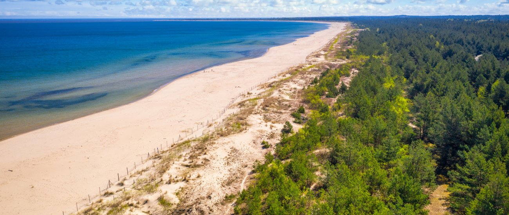

##  Several Postdoc positions available. See further calls below.

--------------------------------------

## Postdoc (2 years). Open till filled.

We are seeking a motivated postdoctoral researcher with interest to work on quantum information and mathematical optimization.
Possible research topics are:

- approximation algorithms in QIT (e.g. ground state energies)
- symmetry- and size reduction of polynomial optimization problems.
- characterization of quantum codes and quantum capacities
- characterization of quantum correlations, entanglement, nonlocality
- machine learning for optimization problems

This two-year position is part of the project “Mathematical Optimization in Quantum Information”, funded by the National Science Centre in Poland. The position from vibrant quantum research in at the Institutes of Theoretical Physics and Informatics of U. Gdańsk and the ICQT Gdańsk.

Candidates should have a PhD in Physics, Mathematics, or Computer Science with a thesis in one the following areas: quantum information and computation, mathematical programming, combinatorial optimization, or coding theory. We appreciate proactive researchers with a good ability for cooperation, a methodological way of working, and proficiency in English. Programming experience (Python/Julia, Sage, GAP, semidefinite programming) is a plus.

The position is offered for 2 years, with a salary of approx. 8.900 PLN gross and travel funding. The position includes Polish social security coverage, including health insurance. See [Calculla](https://calculla.com/polish_net_gross_earnings_calculator) for approximate net earnings, and [Numbeo](https://www.numbeo.com/cost-of-living/in/Gdansk) for cost of living estimates.

Applicants can send their applications (CV, names + email of two references, copy or link to PhD thesis, a research statement is strongly encouraged, signed [data processing statement](data_processing_statement_POSTDOC.pdf)) with subject “NCN Postdoc” to:  felix.huber@ug.edu.pl

We welcome applicants from all backgrounds, and promote a friendly, safe, and supporting team work environment.

## Postdoc (3 years). Deadline 01.09.2026

Postdoc position available within the QuantERA [SDPCode](https://quantera-sdpcode.github.io/) on bounds on quantum codes and randomized constructions. 
Expression of interest to be sent to felix.huber@ug.edu.pl, with the same material as stated for the postdoc position above.

## Postdoc (3 years). Deadline 30.09.2026

Postdoc position available within the QuantERA [ToDiQT](https://quantera-todiqt.github.io/) on device independent code certification. 
Expression of interest to be sent to felix.huber@ug.edu.pl, with the same material as stated for the postdoc position above.

## Hints for applicants:

- In your CV, detail your education and research experience, publications/projects, any awards, and any other activities or interests that you consider relevant. Make it easy to read: Add clear dates including months, add links to material (e.g journal _and_ arxiv links for papers, thesis, code, projects..).

- Ideally, any claim (e.g. rank X in national competition, member of university robot team) should be easily verifiable (e.g. by a link to the respective website or report). If the prize/ranking/competition is not international, consider explaining it. 

- Note for PhD applications: I will consider MSc/BSc thesis and project works much higher than any kind of online certificates or course contents. If you did an exciting project, point it out in the cover letter (and if you wrote a report on it, link it or add it in the single pdf), and explain why it is interesting.

- For your cover letter, consider the following questions:
(1) How does your background relate to the position? (2) How do you see yourself contributing to the research project (with which skills or strenghts)? (3) How does the position relate to your motivation in research and your long-term goals? (4) Which of your previous works best represents you as a suitable candidate, and why? This could be, for example, a publication or part of your PhD/MSc thesis. If you choose a publication with multiple authors, please explain your own contribution.

- To answer some of the questions above, it will help if to look at some recent works: [arxiv](https://arxiv.org/a/huber_f_1.html), for example
[arXiv:2605.13832](https://arxiv.org/abs/2605.13832), [arXiv:2411.04120](https://arxiv.org/abs/2411.04120), [arXiv:2512.20326](https://arxiv.org/abs/2512.20326), [arXiv2310.00612](https://arxiv.org/abs/2310.00612). Note that we use a lot of semidefinite programming, graph theory, tensors, representation theory, non-commutative algebras, and finally quantum information (see the book by Nielsen Chuang).

- By the time of starting the position, you need to have finished the previous degree.

- I prefer applications that were written by yourself, not AI. (I will reject applications that are clearly AI written)

## Details on the recruiting procedure for PhD students

This call above is for the stipend of 5000 PLN net.
At U. Gdansk, every PhD student _also_ needs to be part of the Doctoral school. 
The doctoral school then provides an _additional_ salary of 3466 PLN gross.

The timeline is as follows.

1) With me:

- Application deadline: 30 June
- Interview: 6-10 July
- Decision: 10 July

2) With the doctoral school: 

The successful candidate will then have to apply (with my support) to the doctoral school of the University of Gdańsk. 
You will need all your documents (diploma etc) ready.

- Application dealine: July 12 (an application fee of 250 PLN is needed for that)
- Decision: 30 July.

The start of the position can then not be earlier than 1 October (beginning of the semester).
