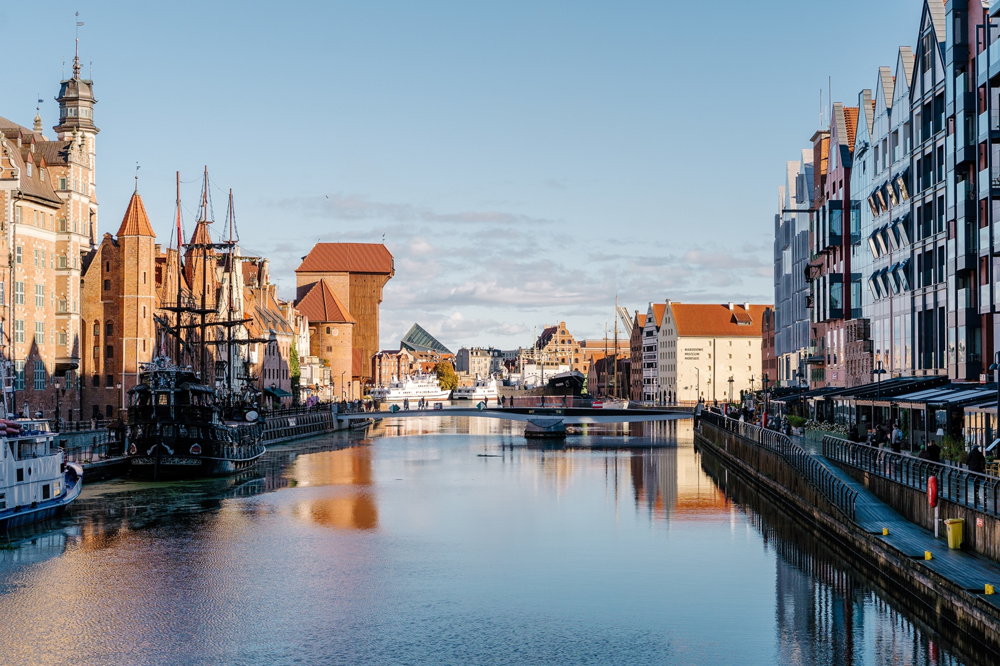

## News

- The group receives the two QuantERA grants [SDPCode](https://quantera-sdpcode.github.io) (Joint with Jens Eisert, Sevag Gharibian, Igor Klep, and Victor Magron) and [ToDiQT](https://quantera-todiqt.github.io/) (joint with Jean-Daniel Bancal, Peter Brown, Gláucia Murta, Stefano Pironio, and Ramona Wolf).
A big thank you to QuantERA and the Polish National Science Centre!

- 1 March 2026: Santiago Llorens Fernández joins the group as postdoc working on representation theory in QIT. Welcome!

- 1 October 2025: Jędrzej Stempin joins the group as PhD student to work on quantum capacities. Welcome!

- 11 July 2025: Gerard Munné defended his thesis "Existence and implementation of quantum error-correcting codes".
He will join the University of Gdańsk. Congratulations Gerard!

- 7 April 2025: The group receives the Sonata-Bis 14 grant [Mathematical Optimization in Quantum Information](https://projekty.ncn.gov.pl/opisy/627287-en.pdf).
A big thank you to the Polish National Science Centre!

- 3 March 2025: We join the NAWA Strategic Partnership grant [KLAR](https://klar.ug.edu.pl/) with U. Lund.

- 10 March 2025: Moisés Bermejo Morán defended his thesis
"Characterizing quantum behaviours: Polynomial optimization in quantum information".
He is now at the University of Bilkent. Congratulations Moisés!

- 21 February 2025: Albert Rico defended his thesis
"Convex Structures in Quantum Information - Symmetric and geometric methods" with distinction.
He is now at Universidad Autònoma Barcelona. Congratulations Albert!

- Talk at [QIP 2025](https://rsvp.duke.edu/event/qip2025/):
[SDP bounds on quantum codes](https://arxiv.org/abs/2408.10323). \\
Joint work with Gerard Munné (Jagiellonian U.) and Andrew Nemec (Duke U.).

- Chapter accepted at Springer Reference Project "Operator Theory II": \\
[Positivity of State, Trace, and Moment Polynomials, and Applications in Quantum Information](https://arxiv.org/abs/2412.12342). \\
Joint work with Victor Magron (LAAS-CNRS Toulouse) and Jurij Volčič (U. Auckland).

## Guests
- David González Lociga, Universitat de Barcelona, 22 - 25 June 2026
- Ojas Parekh, Sandia National Laboratory, 7 - 13 June 2026
- Thomas Coolican Fraser, University of Copenhagen, 11 - 15 May 2026
- Ansgar Burchards, FU Berlin, 27 April - 1 May 2026
- Vito Viesti, U. Bari, 3-6 Mar 2026
- Balázs Pozsgay, Hungarian Academy of Sciences, 15-17 Dec 2025
- Santiago Llorens Fernández, Universitat Autònoma de Barcelona, 15-17 Dec 2025
- Joseph Malkoun, Notre Dame U. Louaize, 30 Jul 2025
- Erwan Don, U. Geneva, 7-10 Jul 2025
- Leonardo Silva Vieira Santos, U. Siegen, 7-10 Jul 2025
- Jendrzej Stempin, U. Poznań, 23 Jun 2025
- Claudio Procesi, U. Sapienzia 16-20 Jun 2025
- Tomás Crosta, U. Bordeaux, 23 April - 15 May 2025
- Muhammet Taha Çakmak, Sabanci University, 24 Jun - 16 Sept 2024
- Sofia Denker, U. Siegen, 9-10 November 2023
- Lisa Weinbrenner, U. Siegen, 9-10 November 2023
- Fynn Otto, , U. Siegen, 8-10 November 2023
- Sébastien Designolle, Zuse-Institut Berlin, 6-9 Mar 2023
- Simon Morelli, U. del País Vasco, 22-25 May 2023
- Andrew Nemec, Texas A&M University, 23 Nov - 14 Dec 2022
- Fionnuala Ni Chuireain, Perimeter and Waterloo), 11 Oct - 11 Nov 2021
- Joel Klassen, U. Delft, 19-24 Nov 2018
